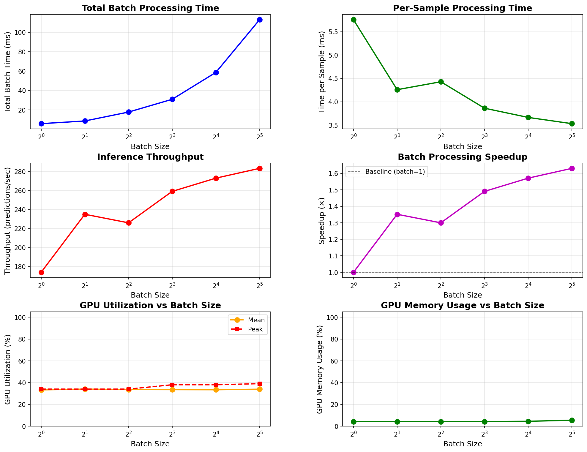

# Vogent Turn - Benchmark Report

**Date:** October 26, 2025 | **Model:** vogent/Vogent-Turn-80M  
**GPU:** NVIDIA A10G (23 GB) | **CUDA:** 12.4 | **PyTorch:** 2.9.0+cu128

---

## Executive Summary

| Metric | Single Inference | Batch (32) |
|--------|------------------|------------|
| **Latency** | 5.0 ms (P95: 5.94ms) | 3.5 ms/sample |
| **Throughput** | 200 preds/sec | 283 preds/sec |
| **GPU Utilization** | 39% (peak: 47%) | 34% (peak: 39%) |
| **GPU Memory** | 4.1% (~940 MB) | 5.4% (~1.2 GB) |
| **Speedup** | 1.0× | 1.63× |

**Key Takeaways:**
- ⚡ Production-ready: 5ms latency, low variance (±0.43ms)
- 🚀 Efficient batching: 1.63× speedup with batch_size=32
- 💾 Low memory footprint: Can run 4-5 parallel instances
- ⚠️ GPU underutilized (33-40%): Room for optimization

---

## Installation

```bash
# 1. Create environment
conda create -n vogent-turn python=3.10 -y
conda activate vogent-turn

# 2. Install package
cd vogent-turn
pip install -e .
pip install nvidia-ml-py3 matplotlib

# 3. Fix BFloat16 issue (vogent_turn/inference.py)
# Line 294 & 433: Add .float() before .cpu().numpy()
# probs = torch.softmax(logits, dim=1)[0].float().cpu().numpy()

# 4. Authenticate
huggingface-cli login
```

**Request access:** https://huggingface.co/vogent/Vogent-Turn-80M

### Common Installation Issues

**Issue 1: Disk Space Error**
```bash
# Error: No space left on device
# Solution: Clean caches before installation
conda clean --all -y
pip cache purge
```

**Issue 2: Package Conflicts**
```bash
# If packages are being loaded from ~/.local instead of conda env
# Solution: Install missing dependencies in conda env
pip install jmespath accelerate python-dateutil boto3 s3transfer
pip install --force-reinstall --no-deps packaging regex safetensors
```

**Issue 3: BFloat16 TypeError**
```python
# Error: TypeError: Got unsupported ScalarType BFloat16
# Solution: Convert to float32 before numpy conversion
# In vogent_turn/inference.py (lines 294 & 433):
probs = torch.softmax(logits, dim=1)[0].float().cpu().numpy()  # Add .float()
```

**Issue 4: Model Access (403 Forbidden)**
```bash
# Error: Cannot access gated repo
# Solution: 
# 1. Visit https://huggingface.co/vogent/Vogent-Turn-80M
# 2. Click "Request Access"
# 3. Login: huggingface-cli login
```

---

## Performance Results

### Single Inference (100 iterations)

| Metric | Value |
|--------|-------|
| Mean | 5.01 ms |
| P50 | 4.94 ms |
| P95 | 5.94 ms |
| P99 | 6.08 ms |
| Std Dev | ±0.43 ms |


*GPU utilization and memory usage over 100 inference runs*

---

### Batch Processing

| Batch | Total (ms) | Per Sample (ms) | Throughput | Speedup | GPU Util | GPU Mem |
|-------|-----------|-----------------|------------|---------|----------|---------|
| 1     | 5.76      | 5.76           | 174/s      | 1.00×   | 33.3%   | 4.1%   |
| 2     | 8.52      | 4.26           | 235/s      | 1.35×   | 34.0%   | 4.1%   |
| 4     | 17.71     | 4.43           | 226/s      | 1.30×   | 33.6%   | 4.1%   |
| 8     | 30.89     | 3.86           | 259/s      | 1.49×   | 33.5%   | 4.2%   |
| 16    | 58.63     | 3.66           | 273/s      | 1.57×   | 33.4%   | 4.5%   |
| **32**| **113.0** | **3.53**       | **283/s**  | **1.63×**| **33.9%**| **5.4%**|



*6-panel analysis: Total time, per-sample time, throughput, speedup, GPU utilization, and memory usage*

---

## Model Performance Example

```
Input: "What is your phone number" → "My number is 804"
Output: Turn Complete: False (25.8% endpoint probability)

Input: "What is your phone number" → "My number is 804 555 1234"  
Output: Turn Complete: True (89.5% endpoint probability)
```

---

## Recommendations

### Production Deployment

**Real-time Voice AI (Low Latency):**
- Batch size: **8**
- Latency: 3.86ms/sample
- Throughput: 259 preds/sec

**Batch Processing (Max Throughput):**
- Batch size: **32**
- Latency: 3.53ms/sample  
- Throughput: 283 preds/sec

**Multi-Instance:**
- GPU memory: Only 4-5% used
- Can run **4-5 parallel instances** on single A10G GPU
- Total throughput: ~1,000-1,400 preds/sec

### Optimization Opportunities

1. **TensorRT conversion:** Potential 2-3× additional speedup
2. **Increase batch size:** GPU memory allows batch_size=64+
3. **Multi-model serving:** GPU utilization at 33-40%, room for more

---

## Running Benchmarks

```bash
# Single inference + GPU monitoring
python benchmark.py

# Batch processing analysis  
python test_batch_processing.py

# Simple test
python run.py
```

---

## System Configuration

**Hardware:**
- GPU: NVIDIA A10G (23 GB)
- Driver: 550.127.05
- CUDA: 12.4

**Software:**
- OS: Linux 6.8.0-1019-aws (Ubuntu)
- Python: 3.10.19
- PyTorch: 2.9.0+cu128
- Transformers: 4.57.1

**Model:**
- Audio: Whisper-Tiny (8 sec @ 16kHz)
- Text: SmolLM-135M (~80M params)
- Mode: Multimodal (audio + text)
- Optimization: torch.compile + BFloat16

---

## Notes

- **Initialization:** ~26s for torch.compile + Triton kernel autotuning (first time only)
- **Model Access:** Gated - requires HuggingFace authentication
- **BFloat16 Fix:** Required for NumPy compatibility (see installation step 3)

---

## References

- Model: https://huggingface.co/vogent/Vogent-Turn-80M
- Blog: https://blog.vogent.ai/posts/voturn-80m-state-of-the-art-turn-detection-for-voice-agents
- Demo: https://huggingface.co/spaces/vogent/vogent-turn-demo
- Code: https://github.com/vogent/vogent-turn

---

**Report Date:** October 26, 2025 | **Environment:** AWS EC2 with NVIDIA A10G GPU
