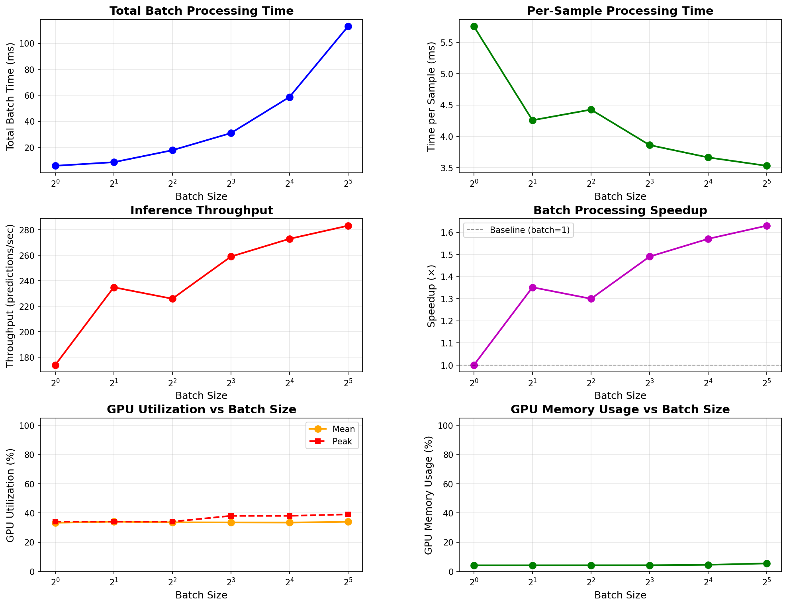

# Vogent Turn - Quick Start Guide

## System Info
- **GPU:** NVIDIA A10G (23 GB)
- **CUDA:** 12.4
- **Driver:** 550.127.05

## Installation (5 minutes)

```bash
# 1. Create environment
conda create -n vogent-turn python=3.10 -y

# 2. Install package
conda activate vogent-turn
cd /path/to/vogent-turn
pip install -e .

# 3. Install benchmark tools
pip install nvidia-ml-py3 matplotlib

# 4. Authenticate with Hugging Face
huggingface-cli login
```

## Quick Fix Required

Edit `vogent_turn/inference.py`:
- Line 294: Add `.float()` before `.cpu().numpy()`
- Line 433: Add `.float()` before `.cpu().numpy()`

## Performance Summary

| Metric | Single | Batch (32) |
|--------|--------|------------|
| **Latency** | 5.0 ms | 3.5 ms/sample |
| **Throughput** | 200/s | 283/s |
| **GPU Util** | 39% | 34% |
| **GPU Memory** | 4.1% | 5.4% |

### Visual Performance Analysis



*Comprehensive 6-panel analysis showing throughput, latency, GPU utilization and memory across batch sizes*

## Run Benchmarks

```bash
# Single inference + GPU monitoring
python benchmark.py

# Batch processing analysis
python test_batch_processing.py

# Simple test
python run.py
```

## Recommendation
- **Real-time:** Use batch_size=8 (259 preds/sec)
- **Max throughput:** Use batch_size=32 (283 preds/sec)
- **GPU headroom:** Can run 4-5 parallel instances

## Example
```python
from vogent_turn import TurnDetector

detector = TurnDetector(compile_model=True, warmup=True)
result = detector.predict(
    audio,
    prev_line="What is your phone number",
    curr_line="My number is 804",
    sample_rate=16000,
    return_probs=True
)
# Result: False (25.8% endpoint probability - needs continuation)
```

Full documentation: [BENCHMARK_REPORT.md](BENCHMARK_REPORT.md)

